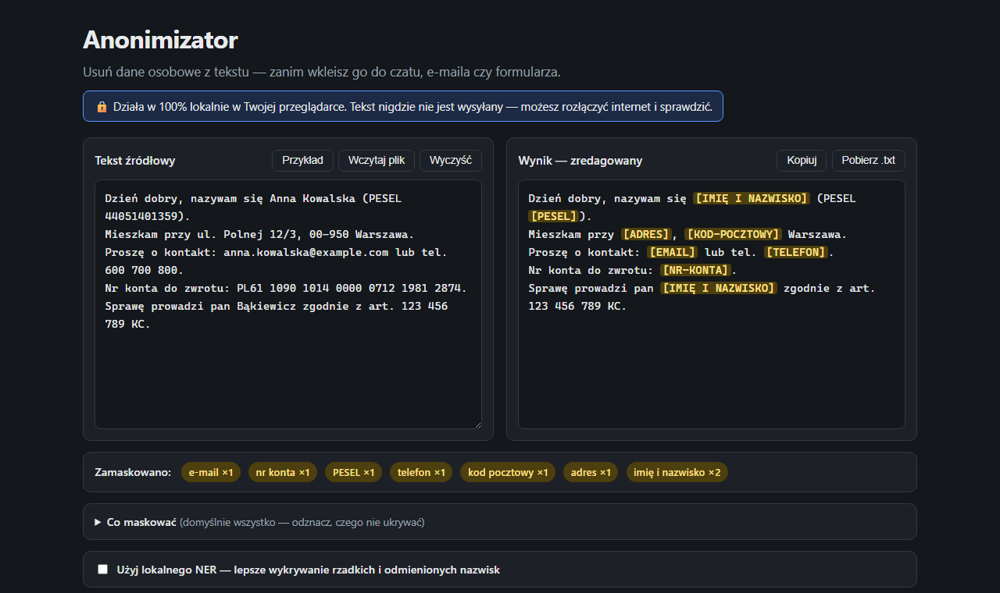

# Anonimizator

[](https://github.com/karolpolikarp/anonimizator/actions/workflows/ci.yml)
[](https://github.com/karolpolikarp/anonimizator/releases)
[](./LICENSE)

Lokalny anonimizator polskich danych osobowych (PII). Zamienia PESEL, NIP, REGON, KRS, numery kont,
numery dowodów i paszportów, e-maile, telefony, adresy, miejscowości, daty urodzenia oraz imiona
i nazwiska na neutralne placeholdery — **zanim** tekst trafi do czatu z modelem językowym, e-maila,
zgłoszenia czy bazy danych.

**Nikt niczego nie serwuje centralnie i nie przetwarza Twoich danych.** Pobierasz aplikację
z tego repozytorium i uruchamiasz na własnym komputerze — cała anonimizacja odbywa się
lokalnie, w Twojej przeglądarce. Możesz rozłączyć internet i sprawdzić.



## Jak to działa i dlaczego jest bezpieczne — w skrócie, bez żargonu

> Ta sekcja jest dla **każdego**, także bez wiedzy technicznej. Reszta README jest bardziej techniczna.

**Co to robi.** Wklejasz tekst, a program znajduje w nim dane osobowe (imię i nazwisko, PESEL, NIP,
adres, miejscowość, e-mail, telefon, numer konta, numer dowodu, KRS itd.) i zamienia je na neutralne
etykiety, na przykład `Jan Kowalski` → `[IMIĘ I NAZWISKO]`, `44051401359` → `[PESEL]`. Dzięki temu
możesz spokojnie wysłać treść dalej — do czatu z AI, e-maila, urzędu — nie ujawniając, kogo dotyczy.

**Gdzie trafiają Twoje dane? Nigdzie.** To jest najważniejsze. Aplikacja to **jeden plik**, który
otwierasz na **własnym komputerze**. Cała praca dzieje się w Twojej przeglądarce, u Ciebie. Program
**nie wysyła** tekstu na żaden serwer, do internetu, do autora ani do nikogo. Nie ma logowania, konta
ani chmury. **Możesz odłączyć internet (wyłączyć Wi‑Fi / wyjąć kabel) i aplikacja nadal będzie
działać** — to najprostszy dowód, że nic nie wychodzi na zewnątrz.

**Skąd pewność, że tak jest naprawdę.**
1. **Sprawdź sam** — odłącz internet i użyj aplikacji; zadziała tak samo.
2. **Kod jest otwarty** (licencja MIT) — każdy może go przeczytać albo poprosić o sprawdzenie
   znajomego informatyka. Nic nie jest ukryte.
3. **Plik jest samodzielny** — nie dociąga niczego w tle podczas pracy.

**Jak program rozpoznaje dane (w uproszczeniu).** Większość danych ma stały wzór, który da się
sprawdzić matematycznie lub po układzie znaków — dlatego trafień „na ślepo" jest mało:
- **PESEL, NIP, REGON, numer konta (IBAN), numer dowodu** mają tzw. *cyfrę/sumę kontrolną* —
  wbudowany w numer sprawdzian poprawności. Program go **przelicza**, więc przypadkowy ciąg cyfr
  (np. numer sprawy albo sygnatura) **nie** zostanie pomylony z PESEL‑em.
- **E‑mail** ma znak `@`, **telefon** to 9 cyfr, **kod pocztowy** to `XX‑XXX` — rozpoznawane po wzorze.
- **Imiona i nazwiska** rozpoznaje po słowniku polskich imion i nazwisk, po typowych końcówkach
  (np. `‑ski`, `‑cki`, `‑icz`) oraz po kontekście („Pan…", „zamieszkały w…", nagłówki formularzy).
- **Miejscowość** maskuje w kontekście adresu i zamieszkania („ul. Kwiatowa 5, **Warszawa**",
  „zamieszkały w **Krakowie**"), ale **nie** w zwykłym zdaniu („spotkanie w Łodzi") ani w nazwie
  instytucji („Sąd Okręgowy w Katowicach") — żeby nie zasłaniać za dużo.

**Czego program może nie złapać.** To narzędzie **pomocnicze, nie gwarancja**. Najtrudniejsze są
np. obce nazwiska bez polskiej końcówki i spoza słownika. Dlatego **zawsze przejrzyj wynik przed
wysłaniem** — masz go od razu obok, z podświetleniem; strzałkami `‹ ›` przejdziesz po kolei przez
zamaskowane fragmenty, a najechanie kursorem pokaże powód każdej maski.

**Co możesz sam ustawić.** W panelu „Co maskować" włączasz i wyłączasz poszczególne rodzaje danych
(pogrupowane w kategorie: Identyfikatory, Kontakt, Finanse, Adres i czas, Dane osobowe). Opcja
„Rozróżniaj osoby" nadaje tej samej osobie stałą etykietę (`[OSOBA‑A]`, `[OSOBA‑B]`) — przydatne
w umowach i pismach, gdzie trzeba wiedzieć, kto jest kim, bez podawania nazwisk.

**Bezpieczeństwo także wtedy, gdy coś nie działa.** Nawet jeśli włączysz zaawansowane, opcjonalne
warstwy AI (opisane niżej) i one się zawieszą — ochrona **nigdy nie spada poniżej** warstwy reguł
i sum kontrolnych. AI może co najwyżej zamaskować *więcej*, nigdy *odsłonić* danych.

## Pobierz i używaj (jeden plik, bez instalacji)

1. Wejdź w [**najnowsze wydanie (Releases)**](https://github.com/karolpolikarp/anonimizator/releases/latest)
   i pobierz **`Anonimizator.html`** (jeden plik — nic nie trzeba rozpakowywać).
2. Otwórz go **podwójnym kliknięciem** — uruchomi się w przeglądarce, prosto z dysku:
   bez serwera, bez instalacji, bez internetu.
3. Wklej tekst albo upuść plik (`.txt`, `.docx`, `.pdf`) — po prawej dostajesz wersję
   zredagowaną do skopiowania. Pliki Word i PDF są czytane w całości lokalnie, jak wszystko tutaj.

> W nagłówku aplikacji widnieje numer wersji z linkiem „sprawdź najnowszą" — jeśli
> kiedyś coś nie działa, najpierw porównaj numer i pobierz świeży plik.

Obok znajdziesz też `JAK-UZYC.txt` z tą samą instrukcją do wydrukowania lub rozesłania.
Alternatywnie sklonuj repo i odpal z kodu (sekcja „Dla programistów" niżej).

## Formy użycia — jeden silnik

- **Aplikacja w przeglądarce** (`apps/web`) — patrz wyżej; 100% offline.
- **Biblioteka npm** (`packages/core`, pakiet `anonimizator`) — zero zależności, działa w Node,
  Deno, Bun i przeglądarce.
- **CLI** — `anonimizator plik.txt`, także stdin → stdout do potoków.
- **Opcjonalny lokalny NER** (`services/ner`) — usługa spaCy PL na Twoim komputerze,
  podnosząca wykrywalność rzadkich nazwisk (szczegóły niżej).

```
Nazywam się Jan Kowalski, PESEL 44051401359, ul. Polna 12/3, tel. 600 700 800.
                                    │
                                    ▼
Nazywam się [IMIĘ I NAZWISKO], PESEL [PESEL], [ADRES], tel. [TELEFON].
```

## Dlaczego mało fałszywych trafień

Tam, gdzie format ma **sumę kontrolną** (PESEL, NIP, REGON, IBAN, nr dowodu), anonimizator ją
**weryfikuje** — przypadkowy ciąg 11 cyfr (sygnatura akt, numer sprawy) nie zostanie uznany za
PESEL. Dodatkowo strażnik kontekstu rozpoznaje odwołania do przepisów („art. 123 456 789",
„poz. …", „Dz.U. …") i nie maskuje ich jako telefonów. Redakcja jest **idempotentna** — ponowny
przebieg po zredagowanym tekście niczego nie psuje.

## Co wykrywa

| Dane | Metoda | Placeholder |
|---|---|---|
| PESEL | 11 cyfr + suma kontrolna | `[PESEL]` |
| NIP | 10 cyfr (też z myślnikami) + suma kontrolna | `[NIP]` |
| REGON | 9/14 cyfr + suma kontrolna | `[REGON]` |
| IBAN / nr konta | mod 97 lub kontekst „konto/rachunek" + 26 cyfr | `[NR-KONTA]` |
| Nr dowodu | 3 litery + 6 cyfr + suma kontrolna | `[NR-DOWODU]` |
| Nr paszportu | kontekst „paszport" + 2 litery + 7 cyfr | `[NR-PASZPORTU]` |
| Numer KRS | kontekst „KRS" + 10 cyfr (też z zerami wiodącymi) | `[KRS]` |
| E-mail | wzorzec adresu | `[EMAIL]` |
| Telefon | 9 cyfr, opcjonalnie +48 | `[TELEFON]` |
| Kod pocztowy | XX-XXX | `[KOD-POCZTOWY]` |
| Data urodzenia | data z kontekstem „ur./urodzony" — cyfrowa i słowna („5 maja 1985") | `[DATA-URODZENIA]` |
| Adres | ul./al./os./pl. + nazwa + numer (też „3 Maja", „gen./ks./św.") | `[ADRES]` |
| Miejscowość | w adresie (po kodzie, przed/po adresie) i przy zamieszkaniu („zamieszkały w Krakowie"); **nie** w prozie/instytucji | `[MIEJSCOWOŚĆ]` |
| Pola formularza | „Nazwisko / Imię / Data urodzenia / Ulica / Miejscowość" z wartością w tej samej lub następnej linii (też WERSALIKAMI) | wg typu |
| Imię i nazwisko | słownik imion + nazwisk (z odmianą), **morfologia nazwisk** (-ski/-cki/-icz/-czyk), kolejność odwrócona (nagłówki e-maili), wyzwalacze kontekstu | `[IMIĘ I NAZWISKO]` |

## Ograniczenia (przeczytaj przed użyciem)

Wykrywanie **imion i nazwisk warstwą podstawową jest heurystyczne**. Warstwa łapie nazwiska ze
słownika (z odmianą), nazwiska o charakterystycznym polskim sufiksie **morfologicznie**
(-ski/-cki/-dzki, -icz/-wicz, -czyk — także rzadkie i odmienione, np. „Gzowskiego", „Bąkiewiczowi"),
pary imię+nazwisko i kolejność odwróconą oraz wyzwalacze kontekstu. Poza zasięgiem warstwy offline
zostają głównie **nazwiska bez polskiego sufiksu, spoza słownika i bez kontekstu** (np. obce:
„Nguyen", „Grynberg"). Domyka je opcjonalny lokalny NER (niżej). Zasada pozostaje: to narzędzie
pomocnicze — **zawsze przejrzyj wynik przed udostępnieniem**.

Benchmark warstwy offline (deterministyczny zbiór, `docs/BENCHMARK.md`): **recall 100%,
precyzja‑proxy 99,4%** (rdzeń, bez NER).

## Opcjonalny lokalny NER (rzadkie i odmienione nazwiska)

Zdanie „Wczoraj Nguyen podpisał umowę z Grynbergiem" zawiera nazwiska bez polskiego sufiksu,
spoza słownika i bez wyzwalacza — warstwa offline ich nie zamaskuje (nazwiska z sufiksem
-ski/-cki/-icz/-czyk łapie już morfologicznie). Rozwiązaniem dla takich przypadków jest **NER**
(model spaCy PL rozpoznający osoby z kontekstu zdania), uruchamiany **na Twoim komputerze**:

```bash
cd services/ner
docker compose up -d      # usługa na 127.0.0.1:8090 (tylko localhost)
```

Dostępne są dwa backendy: **spaCy** (domyślny, lekki) i **HerBERT** (SOTA dla polskiego,
F1≈0,90 — najlepszy recall rzadkich nazwisk; `--build-arg NER_BACKEND=herbert`).
Szczegóły: [`services/ner/README.md`](./services/ner/README.md).

Potem w aplikacji webowej zaznacz „Użyj lokalnego NER". Architektura jest **fail-safe**:

- NER dostaje tekst JUŻ po redakcji strukturalnej — **nigdy nie widzi** surowego PESEL/NIP;
- gdy usługa nie działa / nie odpowiada / przekroczy timeout, wynik zostaje na warstwie
  regex + sumy kontrolne — ochrona nigdy nie spada do zera;
- circuit breaker przestaje odpytywać padniętą usługę (3 porażki → 30 s przerwy).

Z biblioteki: `import { redactPIIFull } from 'anonimizator/ner'` —
`await redactPIIFull(tekst, { url: 'http://127.0.0.1:8090' })`.
Szczegóły: [`services/ner/README.md`](./services/ner/README.md).

## NER bez Dockera (ONNX) — także w przeglądarce

Zweryfikowany model FastPDN jest dostępny jako **ONNX int8 (~125 MB)** w
[Releases → models-fastpdn-onnx-v1](https://github.com/karolpolikarp/anonimizator/releases/tag/models-fastpdn-onnx-v1):

- **W aplikacji przeglądarkowej**: pobierz `anonimizator-onnx-pack.zip` i rozpakuj
  **obok `index.html`** (katalogi `vendor/` i `models/`). Gdy aplikacja jest serwowana
  po http (np. `npx serve .`, hosting, `npm run preview`) — w ustawieniach NER pojawi
  się źródło „w przeglądarce (ONNX, bez Dockera)". Model ładuje się przy pierwszym
  użyciu i działa w pełni offline (inferencja ~kilkadziesiąt ms).
  Uwaga: z `file://` (podwójny klik) przeglądarki blokują wasm/fetch — ta opcja
  wymaga serwowania; paczka offline działa wtedy na warstwie regex+słowniki.
- **W Node**: kompletny przykład [`examples/ner-onnx-node.mjs`](./examples/ner-onnx-node.mjs)
  (`@huggingface/transformers`, ~16 ms na akapit na CPU).

## Warstwa eksperymentalna: lokalny LLM (Ollama/Bielik)

Najgłębsza (i najwolniejsza) siatka bezpieczeństwa: **lokalny model językowy** wskazuje
fragmenty tekstu wyglądające na dane osobowe — tryb *span-extraction*. **LLM niczego nie
przepisuje.** Zwraca wyłącznie listę kandydatów, a maskowanie wykonuje kod biblioteki po
twardej walidacji: kandydat musi wystąpić w tekście znak w znak (halucynacje odpadają),
limit 2–80 znaków i max 100 kandydatów, placeholdery odrzucane. Złośliwy tekst (prompt
injection) może więc co najwyżej doprowadzić do NADmaskowania — nigdy do odmaskowania.

```bash
# wymaga zainstalowanej Ollamy: https://ollama.com
ollama pull SpeakLeash/bielik-11b-v2.3-instruct:Q4_K_M   # polski model Bielik (~7 GB)
# Ollama nasłuchuje domyślnie na http://127.0.0.1:11434
```

```ts
import { redactPIIUltra } from 'anonimizator/llm';

const { redacted, found } = await redactPIIUltra(tekst, {
  ner: { url: 'http://127.0.0.1:8090' },                          // opcjonalnie
  llm: { model: 'SpeakLeash/bielik-11b-v2.3-instruct:Q4_K_M' },   // Ollama lokalnie
});
```

Kolejność warstw: redakcja strukturalna (regex + sumy kontrolne) → opcjonalny NER →
opcjonalny LLM. Model widzi tekst **już po** redakcji strukturalnej — nigdy surowego
PESEL/NIP — i wszystko dzieje się lokalnie, na Twoim komputerze.

**Ostrzeżenia:**

- **Eksperymentalne** — jakość zależy od modelu; to dodatkowa siatka, nie gwarancja.
  Zawsze przejrzyj wynik.
- **Wolne** — odpowiedź lokalnego LLM to sekundy, nie milisekundy (domyślny timeout 60 s;
  analizowane jest pierwsze 6000 znaków tekstu).
- **Wymaga mocnego sprzętu** — Bielik 11B w kwantyzacji Q4 potrzebuje ~8 GB RAM/VRAM;
  na słabszym sprzęcie wybierz mniejszy model.
- **Fail-safe jak przy NER** — awaria/timeout/brak Ollamy nigdy nie obniża ochrony:
  wynik zostaje na wcześniejszych warstwach, a circuit breaker (3 porażki → 30 s)
  przestaje odpytywać padniętą usługę.

## Użycie — biblioteka

```bash
npm install anonimizator
```

```ts
import { redactPII, hasPII, describeFindings } from 'anonimizator';

const { redacted, found } = redactPII('Mój PESEL to 44051401359');
// redacted → 'Mój PESEL to [PESEL]'
// found    → [{ type: 'PESEL', count: 1 }]

hasPII('czysty tekst');            // false
describeFindings(found);           // ['PESEL']
```

Opcjonalny drugi parametr pozwala wybrać typy i podmienić placeholdery:

```ts
// maskuj tylko PESEL i e-mail
redactPII(tekst, { types: ['PESEL', 'EMAIL'] });

// własny placeholder (bez cyfr i „@" — inaczej łamiesz idempotencję)
redactPII(tekst, { masks: { PESEL: '[UKRYTO]' } });

// spójna pseudonimizacja: ta sama osoba → ta sama etykieta (także w odmianie)
redactPII('Kowalski pozwał Nowaka. Kowalskiemu zależy na ugodzie.', { pseudonyms: true });
// → '[OSOBA-A] pozwał [OSOBA-B]. [OSOBA-A] zależy na ugodzie.'
// (w CLI: flaga --osoby; w aplikacji: „Rozróżniaj osoby" w panelu „Co maskować")
```

Eksportowane są też walidatory sum kontrolnych: `isValidPesel`, `isValidNip`, `isValidRegon9`,
`isValidRegon14`, `isValidIban`, `isValidDowod`.

**Ważne:** `found` zawiera wyłącznie typ i liczbę wystąpień — **nigdy oryginalne wartości**,
więc można go bezpiecznie logować.

## Użycie — CLI

```bash
npx anonimizator dokument.txt                  # wynik na stdout, statystyki na stderr
npx anonimizator dokument.txt --out czysty.txt
type dokument.txt | npx anonimizator           # Windows
cat dokument.txt | npx anonimizator            # Linux/macOS
```

## Dla programistów

```bash
npm install
npm run dev        # http://localhost:5173 (hot reload)
npm run build      # statyczne pliki w apps/web/dist — działają też otwarte prosto z dysku (file://)
npm test
```

Aplikacja nie ma backendu, analityki ani żadnych zapytań sieciowych — cała logika wykonuje
się w przeglądarce. Jedyny wyjątek to świadomie włączony lokalny NER (żądania idą wyłącznie
pod adres localhost wskazany przez użytkownika).

## Struktura repozytorium

```
packages/core/    # silnik redakcji (TS, zero zależności) + klient NER + CLI + testy (Vitest)
apps/web/         # statyczna aplikacja (Vite, bez frameworka), działa z file://
services/ner/     # opcjonalna lokalna usługa NER (Python/FastAPI + spaCy PL, Docker)
```

## Testy

```bash
npm test          # sumy kontrolne, maskowanie, fałszywe trafienia, idempotencja,
                  # opcje types/masks, fail-safe NER (mock), circuit breaker
```

## Roadmapa

- [ ] NER bez Dockera: model ONNX odpalany bezpośrednio w przeglądarce (transformers.js) —
      pełny recall nazwisk bez instalowania czegokolwiek.
- [x] Konfigurowalne placeholdery i wybór typów do maskowania (v0.2.0).
- [x] Obsługa plików DOCX w aplikacji webowej — ekstrakcja tekstu lokalnie (v0.3.0).
- [x] Obsługa plików PDF — pdf.js w buildzie single-file, w pełni offline (v0.4.0).
      PDF-y bez warstwy tekstu (skany) dostają jasny komunikat — OCR nie jest wspierany.

## Pochodzenie

Silnik redakcji został wydzielony z produkcyjnego kodu [JakiePrawo.pl](https://jakieprawo.pl),
gdzie maskuje dane osobowe w pytaniach użytkowników, zanim trafią do modelu językowego
(zgodność z RODO). Reguły i testy regresji pochodzą z realnych przypadków.

## English (summary)

**Anonimizator** is a local-first redactor for Polish PII (personal data): PESEL, NIP, REGON,
IBAN and national ID numbers are validated against their checksums (very few false positives);
e-mails, phones, addresses and person names are matched heuristically, with an optional
self-hosted spaCy NER service for rare surnames. Ships as a zero-dependency npm library +
CLI (`anonimizator`), and a single-file offline web app (grab `Anonimizator.html`
from Releases and just double-click it — nothing ever leaves your machine). MIT licensed.

## Licencja

MIT
